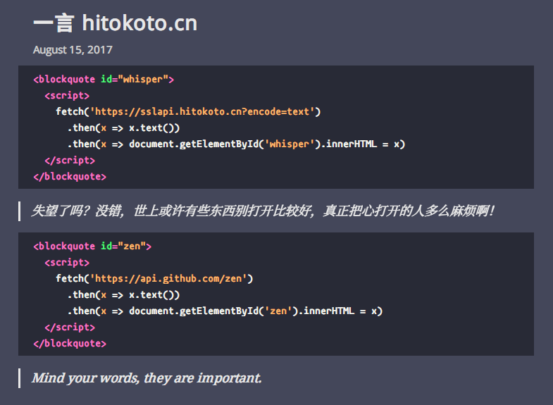

# Jekyll Blog

## Features

- make use of github-pages and jekyll
- mock telegra.ph theme
- rake tasks

```
rake build          # build to destination folder
rake commit         # add and commit
rake draft[file]    # new draft file
rake include[file]  # new include file
rake layout[file]   # new layout file
rake post[file]     # new post file
rake publish        # publish draft to post
rake sass[file]     # new sass file
rake unpublish      # unpublish post to draft
```

## Screenshots

<style>img{margin:20px;zoom:.5}</style>





## License

WTFPLv2.
